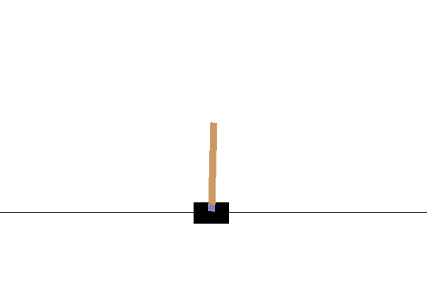
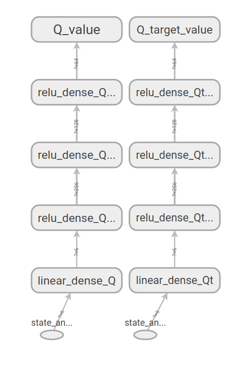
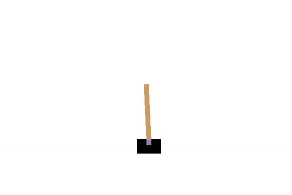
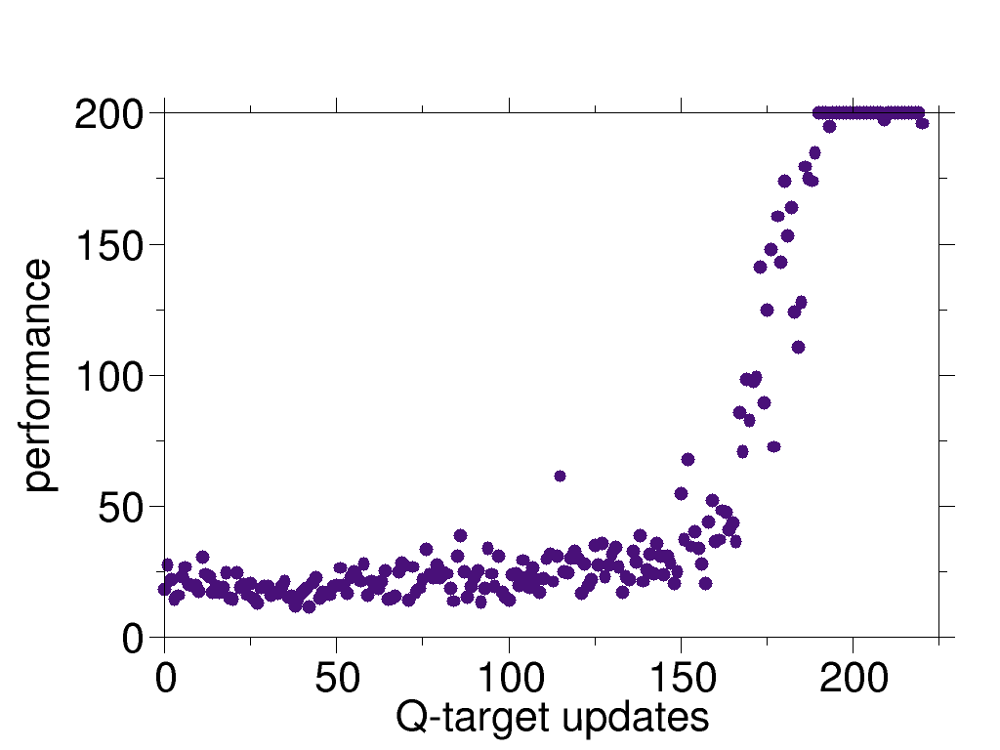
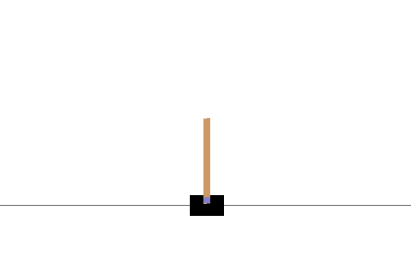

# cart-pole-deep-RL-DDQN

After implementing [REINFORCE](https://github.com/nima-siboni/simplest-world-REINFORCE) and [Actor-Crtitic](https://github.com/nima-siboni/cart-pole-deep-RL-actor-critic), it is finally time for Double DQN (DDQN)! A great advantage of DDQN over the previous implementations of the actor-critic and the reinforce is that DDQN is off-policy, unlike those two which are on-policy.

## The problem

The problem is to train an agent which stabilizes a pole on a cart (an inverted pendulum problem). This is a classic problem in dynamics and control theory and is used as a benchmark for testing control strategies [[1]](https://en.wikipedia.org/wiki/Inverted_pendulum#:~:text=An%20inverted%20pendulum%20is%20a,additional%20help%20will%20fall%20over).

In the current presentation of the problem, the agent:
- observes the *current* position and velocity of the cart and the pole, 
- can only move the cart forward and backward for a fixed distance (+1/-1) every time. So the action space is discrete.


 
The environment is cart-pole-v1 env. from OpenAI Gym. A deterministic environment which rewards the agent by +1 every time step that it does not fail. The failing is defined as The agent fails when the angle between the pole and the vertical line exceeds a certain threshold. Here is an example of failure when the controller just moves the cart irrespective of the state of the pole.





## The approach

Here, the double-DQN method is used to stabilize the inverted pendulum.

This approach involves two deep neural networks (DNN) with similar structures:
- Q net, and
- Q-target net.

Here, the DNNs are designed such that they accept a state-action pair and output the Q value associated with the given state-action pair.




## Results

Here, before getting into the details of training of the agents, the performance of the trained agent is shown. 

First, we show a full episode of the agent's behavior, in the environment in which it is trained (i.e. where there is no random perturbations from the ambient). This is for an agent which has reached the maximum performance. We also show quantitatively how the performance is improved as the number of training rounds increases.

Next, we put the agent in a more realistic environment, e.g. where there is a random noise acting on the agent. How well an agent does in an environment which is not its training environment is an important question for real world applications of the RL.

### In absence of random perturbations
Let's first start with a visual demonstration of an episode of a trained agent, as shown here. One can qualitatively see the improvement of the agent in stabilizing the pole.




One can quantify the *performance* of the agent simply as the duration of the time interval over which it holds the pole before failing. In the following figure, we showed the performance for each episode and also the averaged performance for each policy iteration step. In this case, the data from 60 episodes are used for each policy iteration step.



The maximum performance is limited to 200 steps as this is set by the cart-pole environment of OpenAI Gym as a limit.

### In presence of random perturbations

We also test the agent in presence of random perturbations. Here, we add "wind" which is blowing randomly and leads to a change in the angle of the pole. An instance of such an experiment is presented here, where the color of the background changes as the wind blows. One can observe that although the agent is trained in absence of the wind, it still performs reasonably well in the presence of the wind.



The windy experiments can be performed using ```simulator-windy.py```. The strength of the wind and its period can be changed by ```wind_power``` and ```wind_period``` variables in the script.


## Requirements
Besides the python3.6 and pip3

* gym==0.17.2
* keras
* numpy
* random2
* tensorflow==2.2.0
* sys-os (only for simulations)

```
pip3 install -r requirements.txt
```
## Usage

To execute the experiment loops and the learning one can run:
```
python3 experience-and-learn.py
```
This script runs experiments for a random policy and improves it. 

To use the simulator for sampling the not/trained agent, run

```
python3 simulator.py
```

## The code structure

The main program is organized in the following way:
* **initialization**: creating the agent with random initial weights/biases. Setting up the environment.

* **filling up the replay buffer**: 

  The simulation is run with the initial random policy for a number of episodes, and the events of all episodes are saved in the replay buffer. Each *event* is a tuple of 
  
   

  where *s* is the current state, *a* is the taken action, *r* is the obtained reward for *(s, a)*, *s'* is the state after taking the action, and *done* indicates whether the end of the episode is reached or not.
  
  Each episode is simulated in the following manner:
  
  **(1)** a random initial state is assigned to the *state* variable,

  **(2)** given the *state*, an action (*a*) is chosen using the policy,

  **(3)** the action *a* is given to the environment, and the environment returns the new state, the reward, and a signal indicating the end of the episode.
  
  **(4)** if the process is not ended, the new state is assigned to the variable *state* and the execution continues to step **(2)** . 

This process is repeated for a number of episodes and all the data are gathered in an instance of the class *History*. 

One should note that the events can come from any policy, as the DDQN is an off-policy method. Nevertheless, a policy which is highly exploratory is preferable as the agent benefits from learning from diverse experiences.

* **learning** : After sampling based on the policy, the obtained data is used to train the DNNs. The train the agent, 

  **(1)** first a random batch is taken from the replay buffer.
  
  **(2)** using the events of the batch the Q-net is trained to fit the Q-values estimated by the Q-target network (this is DQN, and in DDQN there is a small change here, which is introduced to decrease the overestimation of the Q-values). After finishing this step, the algorithm loops back to the step **(1)**. This procedure continues for a fixed number times.
  
  **(3)** After looping over **(1)** and **(2)**, we go back and collect one more episode and add it to the buffer. If the replay buffer has reached its maximum size, some of the old events are deleted (based on first in, first out) and the new events are included. This step is repeated a number of times, where for each time, a complete set of repetition for steps **(1)** and **(2)** are carried out.
  
  **(4)** Finally, the policy with which the experiences are done is changed. After changing the policy, we repeat the whole process from the step **(1)**.
  
The algorithm above is shown best by the following DQN sudo code:

from the [Deep RL course](http://rail.eecs.berkeley.edu/deeprlcourse/) by S. Levin. 

On changing the policy (step 4): In our implementation, this is done by assigning the learned Q-network to the Q-target network, and then using the Q value predictions of this network with epsilon greedy as the exploring policy. This is not a unique choice and one has the freedom of choosing any policy. This freedom is due to the off-policy nature of the DQN (and also DDQN). Nevertheless it might be a good idea to somehow involve the learned information into the policy.
